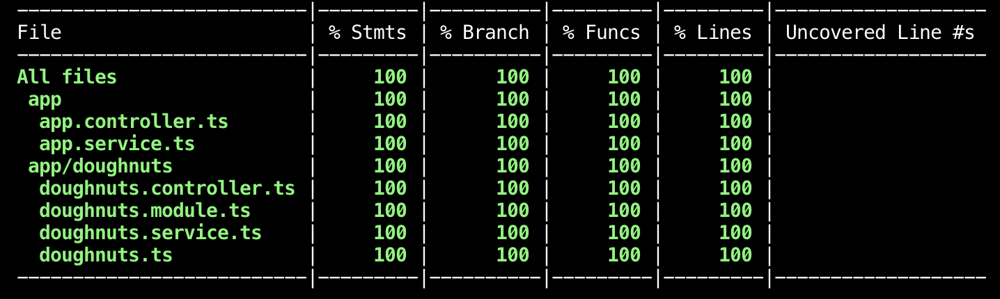

<div align="center">


[](https://github.com/prettier/prettier)

</div>

<hr>

## What is Doughnuts API? 🍩

This is a [NX Monorepo](https://nx.dev) that will provide you with a Doughnuts API app ready to use. When you build this project it will fetch donuts being sold at [Boxcar Donuts](https://www.bxcrdonuts.ca/) 

It will include names, descriptions, prices, images and if its a special doughnut meaning that its available for a limited time or if its a standard doughnut.

```ts
id: "double-espresso",
name: "Double Espresso",
description: "Our house glaze infused with fresh ground 49th Parallel espresso. Our coffee shop might not be open but this is really all you need!",
price: "$3.50",
imageUrl: "https://static.wixstatic.com/media/1f7fda_11e1b4fe41c14dddaf44c4f06aa5635f~mv2.jpg"
```

## Setup & Run the Application
### Get Started
```bash
yarn
```

### Build Doughnuts
Using this command will fetch the new weekly doughnut flavours that are updated every Tuesday.

```bash
yarn doughnuts:build
```

### Start API

Setup server to load your data on `localhost:3000`

```bash
yarn start api
```

To view [Swagger](https://swagger.io/docs/) docs go to [http://localhost:3000/api](http://localhost:3000/api)

## APIS 
The following endpoints are available for you to use

```bash
# Returns all doughnuts
/doughnuts 

# Returns a single doughnut
/doughnuts/:dounughtId
```

## Continuous Integration

Continuous Integration (CI) has been setup using GitHub Actions. Please refer to the `ci.yml` file for specifics.

Linting and tests are executed, and a test coverage report is posted to the corresponding PR.

The current CI `build` status is displayed on the README as a badge:


## Coverage Reports



Coverage reports are posted as an autogenerated PR comment, if the CI pipeline is configured with a valid `NX_GITHUB_API_TOKEN`.

To run the coverage report locally, it is easiest done with

```bash
yarn test:api:coverage
```


## Scaffolded using NX

### Build

Run `nx build api` to build the project. The build artifacts will be stored in the `dist/` directory. Use the `--prod` flag for a production build.

### Running unit tests

Run `nx test api` to execute the unit tests via [Jest](https://jestjs.io).

Run `nx affected:test` to execute the unit tests affected by a change.

### Running end-to-end tests

Run `ng e2e api` to execute the end-to-end tests via [Cypress](https://www.cypress.io).

Run `nx affected:e2e` to execute the end-to-end tests affected by a change.

### Understand your workspace

Run `nx dep-graph` to see a diagram of the dependencies of your projects.

### Further help

Visit the [Nx Documentation](https://nx.dev) to learn more.
