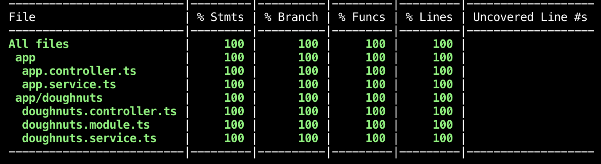

<div align="center">


[](https://github.com/prettier/prettier)

</div>

<hr>

## What is Doughnuts API? 🍩

This is a [NX Monorepo](https://nx.dev) that will provide you with a Doughnuts API app ready to use. When you build this project it will fetch doughnuts being sold at [Boxcar Donuts](https://www.bxcrdonuts.ca/)

It will include names, descriptions, prices, images and if its a special doughnut meaning that its available for a limited time or if its a standard doughnut.

```tsx
id: "lemon-sherbet",
name: "Lemon Sherbet",
price: "$3.25",
description: "Our house glaze infused with naturallemon flavour and a touch of lemon buttercream. Tart and tangy on top of our soft yeast risen donut.",
type: 'standard' | 'weekly',
imageUrl: "https://boxcardonuts.ca/wp-content/uploads/2020/05/271BE853-10DE-4DB2-B7A2-A38CB876A865-scaled.jpeg"
```

## Setup & Run the Application

### Get Started

```bash
yarn
```

### Build Doughnuts

Using this command will fetch the new weekly doughnut flavours that are updated every Tuesday.

```bash
yarn doughnuts:build
```

### Start API

Setup server to load your data on `localhost:3000`

```bash
yarn start api
```

To view [Swagger](https://swagger.io/docs/) docs go to [http://localhost:3000/api](http://localhost:3000/api)

## APIS

The following endpoints are available for you to use

```tsx
// Returns all doughnuts
/doughnuts

// Returns filtered results of standard/weekly doughnuts
/doughnuts?type=doughnutType

// Returns a single doughnut
/doughnuts/:dounughtId
```

## Continuous Integration

Continuous Integration (CI) has been setup using GitHub Actions. Please refer to the `ci.yml` file for specifics.

Linting and tests are executed, and a test coverage report is posted to the corresponding PR.

The current CI `build` status is displayed on the README as a badge:

## Coverage Reports



Coverage reports are posted as an autogenerated PR comment, if the CI pipeline is configured with a valid `NX_GITHUB_API_TOKEN`.

To run the coverage report locally, it is easiest done with

```bash
yarn test:api:coverage
```
